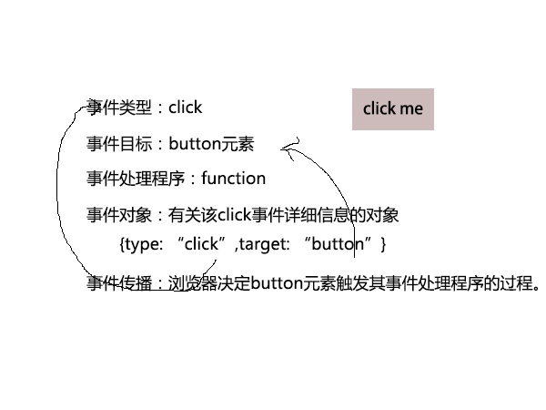

# 第17章 事件处理

* **事件类型(event type)**

事件类型是一个用来说明发生什么类型事件的字符串。例如，`mousemove`表示用户移动鼠标，`keydown`表示键盘上某个键被按下。

* **事件目标(event target)**

事件目标是发生的事件或与之相关的对象。例如，window上的load事件或button元素的click事件。

* **事件处理程序(event handler)**

事件处理程序或事件监听程序是处理或响应事件的函数。

* **事件对象(event object)**

事件对象是与特定事件相关且包含有关该事件详细信息的对象。事件对象作为参数传递给事件处理程序（不包括IE8及之前版本，在这些浏览器中有时仅能通过全局变量event才能得到）。所有的事件对象都有用来指定事件类型的type属性和指定事件目标的target属性。（在IE8及之前版本中用srcElement而非target）每个事件类型都为其相关事件对象定义一组属性。

* **事件传播(event propagation)**

事件传播是浏览器决定哪个对象触发其事件处理程序的过程。对于单个对象的特定事件（比如Window对象的load事件），必须是不能传播的。当文档元素上发生某个类型的事件时，然而，它们会在文档树上向上传播或“冒泡”（bubble）。

* **事件捕获(event capturing)**

事件传播的另外一种形式称为事件捕获（event capturing），在容器元素上注册的特定处理程序有机会在事件传播到真实目标之前拦截它。IE８及之前版本不支持事件捕获，所以不常用它。

## 17.1 事件类型

### 17.1.1 传统事件类型

**1.表单事件**

**2.Window事件**

Window事件是指事件的发生与浏览器窗口本身而非窗口中显示的任何特定文档内容相关。

load,unload,beforeunload,onerror,focus,blur,resize,scroll

**3.鼠标事件**

**4.键盘事件**

### 17.1.2 DOM事件

### 17.1.3 HTML5事件

### 17.1.4 触摸屏和移动设备事件

Safari产生的手势事件用于两个手指的缩放和旋转手势。当手势开始时生成gesturestart事件，而手势结束时生成gestureend事件。在这两个事件之间是跟踪手势过程的gesturechange事件队列。这些事件传递的事件对象有数字属性scale和rotation。

## 17.2 注册事件处理程序

注册事件处理程序有两种基本方式。第一种方式出现在Web初期，给事件目标对象或文档元素设置属性。第二种方式更新并且更通用，是将事件处理程序传递给对象或元素的一个方法。

### 17.2.1 设置JavaScript对象属性为事件处理程序

注册事件处理程序最简单的方式就是通过设置事件目标的属性为所需事件处理程序函数。

事件处理程序属性的缺点是其设计都是围绕着假设每个事件目标对于每种事件类型将最多只有一个处理程序。如果想编写能够在任意文档中都能使用的脚本库代码，更好的方式是使用一种不修改或覆盖任何已有注册处理程序的技术。

### 17.2.2 设置HTML标签属性为事件处理程序。

